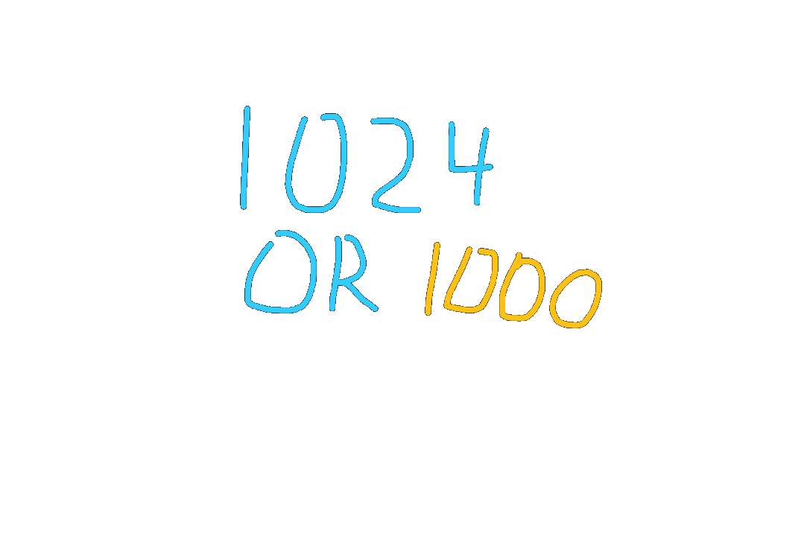

# 1024 or 1000?

There is a misunderstanding that occurs much too often between developers. Is a kilobit 1024 or 1000 bits?

Officially, a kilobit is a thousand bits. A thousand bits, that was the number that most if not all committees agree on, including the IEC and IEEE. So question settled, right?

Not really. That’s because for a very long time, a kilobit has been referred to as 1024 bits. Long enough for it cause confusion, but not long enough for it to become an old trivia fact.

Maybe one day, more developers will start using kibibits (Kib), which is the technical way to refer to 1024 bits, but today is not that day.

...

...

But I can’t just leave it here. Why are these developers so attached to 1024? What does adding 24 do? Why is it so special to them?

Well let’s take a look at a practical example. Let’s say I have a 16 bit pointer, meaning I can reference…65.536kb of memory? Wait, something isn’t right. Why is it a fraction? And it’s surprisingly close to the standard 64kb of mem — oh, I get it.

64kb is a lie. It’s 64kib. It’s exactly 64kib. How does it round so well? It’s because 1024 is 2¹⁰! How could I have been so dumb? 1000 is not a power of two, so of course you won’t be able to divide a power of two by it and expect a normal answer. See, look:

2¹⁶/2¹⁰ = 2⁶. It’s just subtraction! It’s beautiful!

Oh yea, right. *Ahm ahm*. Kib for the win guys, right?

