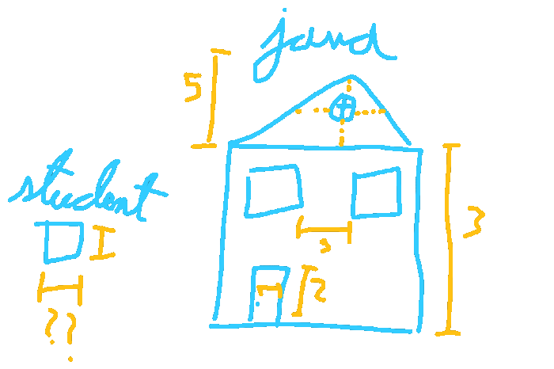

# The Problem with AP CS

Like many fields of engineering, there are two aspects every programmer works with. There is the problem solving, which tests your knowledge and skills, and then there is the technical know-how, which tests your patience.

Many programmers enjoy difficult problems utilizing creative endeavors. They often take a considerable amount of time to solve, yet they go through it with sheer focus and joy. And when they’ve got it, they feel like absolute geniuses. They are engineers proud of their work. It puts a tear in my eye.

Many programmers also talk about how often they want to torch their computer because CMake couldn’t locate a native compiler or because pip blocked updates since it didn’t receive any gift for Christmas last year. Alas, tools share our mood swings as well.

<figcaption>Process this, ugly computer!</figcaption>

So naturally, when it comes to engaging a class, using a simple toolset with a focus on problem-solving might seem like the most obvious course of action. However, the college board would disagree.

Instead, the curriculum focuses on Java, emphasizing OOP. This complicates the toolset and forces students to think much more about the technicals rather than the solutions. Simply put, why should beginners use a paradigm that was developed to solve problems regarding large software and architecture when they’re unlikely to encounter such problems?

<figcaption>Maybe I should’ve gone for fewer letters. The hand cramp is real.</figcaption>

Students often daze when they learn concepts such as classes, inheritance, and polymorphism since they’ve not likely encountered a problem remediable by these techniques.

The college board takes it further by teaching the JVM’s and the JRE’s role in forming cross-platform applications. The student at that point barely knows what a platform is!

Do not take this wrong, however. I’m not advocating for the technicals to be dismissed. I do not think that they should be as emphasized as they currently are, keeping in mind that students at that point have not yet finalized their major. Many students initially found programming to be unappealing but found their passion when they pursued it independently. And I believe that even under classroom circumstances, it’s possible to have an experience similar to that of a self-learner, if not better.
