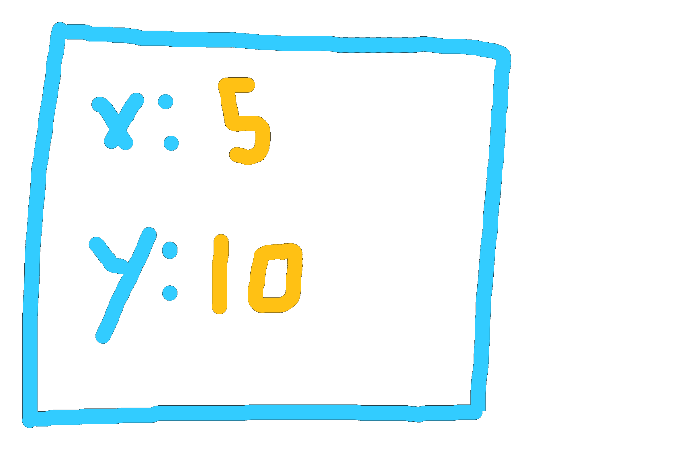
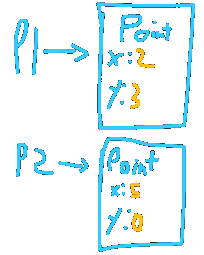

# Classes

**I highly recommend you as the reader to write the code shown here. Don’t copy and paste. Write everything word for word. You’re encouraged to experiment.**

The idea behind classes should be intuitive, as they simply allow us to group related data together. However, to prove their usefulness through example, let me introduce to you a program. The program is simple. It adds points.

	:::java
	public class Main
	{
		public static void main(String[] args)
		{
			// (2, 3)
			double x1 = 2;
			double y1 = 3;
	
			// (5, 0)
			double x2 = 5;
			double y2 = 0;
	
			// p1 + p2
			double x3 = x1 + x2;
			double y3 = y1 + y2;
	
			String output = String.format("(%.2f, %.2f) + (%.2f, %.2f) = (%.2f, %.2f)", x1, y1, x2, y2, x3, y3);
			System.out.println(output);
			// Output:
			// (2.00, 3.00) + (5.00, 0.00) = (7.00, 3.00)
		}
	}

The code works fine, however, the issues that exist are not regarding the functionality of the code. Rather, it regards the scalability of the code. If we want to display another result where we subtract two points, here’s how’d we go about that:

	:::java
	public static void main(String[] args)
	{
		// (2, 3)
		double x1 = 2;
		double y1 = 3;

		// (5, 0)
		double x2 = 5;
		double y2 = 0;

		// p1 + p2
		double x3 = x1 + x2;
		double y3 = y1 + y2;

		// (20, 30)
		double x4 = 20;
		double y4 = 30;

	 	// (24, 30)
		double x5 = 24;
		double y5 = 30;
	  
	  	// p5 - p4
		double x6 = x5 - x4;
		double y6 = y5 - y4;

		String output = String.format("(%.2f, %.2f) + (%.2f, %.2f) = (%.2f, %.2f)", x1, y1, x2, y2, x3, y3);
		String output2 = String.format("(%.2f, %.2f) - (%.2f, %.2f) = (%.2f, %.2f)", x5, y5, x4, y4, x6, y6);
		System.out.println(output);
		System.out.println(output2);
		// Output:
		// (2.00, 3.00) + (5.00, 0.00) = (7.00, 3.00)
		// (24.00, 30.00) - (20.00, 30.00) = (4.00, 0.00)
	}

You’ll notice that messing up this code can be really easy. Seeing how we have 6 different points, it’s incredibly easy to add the wrong points. Also, note that if we choose to represent the points as vectors, more complicated operations, such as scalar multiplications and normalization, would be difficult to interpret just based on the code, and requires the memorization of many formulas.

Other problems include printing a point. Outputting a point takes up almost the entire width of my screen, and if I were to update how I print each point, I’d have to update two different locations. It may not look like much with a codebase of fewer than hundred lines, but it’s common to have codebases that are more than a thousand lines of code, and updating every instance where a point could be printed would be a hassle of a task.

You might suggest we use methods to fix both of these problems. However, Java does not support returning more than one value.

	:::java
	// If we were to write an add_points method,
	// currently, we can only return an integer.
	// This is insufficient, as a point requires two integers.
	public static int add_points(int x1, int x2, int y1, int y2)

## Making a Point class
Making a point class is rather straightforward. Here’s the simplest version:

	:::java
	// Note: This would be outside of the Main class but within the same file.
	class Point
	{
		double x;
		double y;
	}

There you have it. Our new code would look like this:

	:::java
	public static void main(String[] args)
	{
		// (2, 3)
		Point p1 = new Point(); // Creating a new "Point"
		p1.x = 2;
		p1.y = 3;

		// (5, 0)
		Point p2 = new Point(); // Creating another "Point", different from p1
		p2.x = 5;
		p2.y = 0;

		// p1 + p2
		Point p3 = add_points(p1, p2);

		// For brevity, the subtraction part was removed

		String output = String.format("(%.2f, %.2f) + (%.2f, %.2f) = (%.2f, %.2f)", p1.x, p1.y, p2.x, p2.y, p3.x, p3.y);
		System.out.println(output);
		// Output:
		// (2.00, 3.00) + (5.00, 0.00) = (7.00, 3.00)
	}

	// Our add_points method still returns one value,
	// however, that value contains the two integers we want
	public static Point add_points(Point p1, Point p2)
	{
		Point p = new Point(); // Creating a new "Point"
		// Adding the two points and assiging to the newly created point
		p.x = p1.x + p2.x;
		p.y = p1.y + p2.y;
		return p; // Note that the old points are NOT modified.
		// A new point is created as a result of this operation.
	}

All we have done is group related data together under a common name. We do this by first creating a `Point` class, and then we create `Point` objects, which follow the “blueprint” of the `Point` class. This is similar to how we create new `int` or `double` variables, with the difference being that our type is able to hold more values and methods (we’ll get to that).

This can be better visualized as such. Notice how every `Point` object has the fields `x` and `y`. This is because we defined the structure of a `Point` object to have those fields when we defined `class Point`. We can then modify an object’s field by using the `.` (dot) operator. So, `p2.x = 5` changes the `x` variable in the `p2` object to 5, instead of the default 0.

To create a new `Point` object for us to modify, we use the `new` operator, followed by the type and parenthesis, as if we are invoking a method. The reasoning for this will be covered later. For now, take `new Point()` as how you create a new `Point` object.

## Making Code Easier

Notice that we have three problems. `add_points` for one, is in an inappropriate place. You can imagine when you're dealing with lots of data, and each group of data has its own group of methods related, throwing all the methods in a single file can become counter-productive. The second problem is that constructing point objects is tedious, as we need to assign every value manually. For classes that are more sophisticated, this can become troublesome quickly. The other problem is that outputting each point is not only time-consuming, but if we want to change how we print a point, we have to look through every needle in the haystack, and in a large program, that can destroy the momentum of the project.

## The First Problem, Methods
We have several ways of fixing the first problem, all of which are rather simple. We can first start by adding a static method to point as such:

	:::java
	class Point
	{
		double x;
		double y;

	  	// This is the same method we've written before, but now in the Point class.
	  	// That means to use the method, you have to first say the class it's in,
	  	// then the method name. So: "Point.add_points(p1, p2)"
	  
	  	// Note the "static" keyword. For now, take it for granted.
		public static Point add_points(Point p1, Point p2)
		{
			Point p = new Point();
			p.x = p1.x + p2.x;
			p.y = p1.y + p2.y;
			return p;
		}
	}

All we did is displace the method from the `Main` class to the `Point` class. This means, to invoke the method, we do the following:
	
	:::java
	Point p3 = Point.add_points(p1, p2);

Very straightforward. We could do even better, however. Notice that the first parameter of the method is a `Point`. This is a good indicator that the method should not be static, however, as you gain experience, you’ll know which methods should and shouldn’t be static. But know that all methods can be either or, and it’s simply a matter of design, not technicality, whether a method should be static. For the sake of demonstration, however, let’s turn the method into an instance method. Here's the code:

	:::java
	class Point
	{
		double x;
		double y;

	  	// Again, this is the same method as before, although
	  	// we changed the name from "add_points" to "add" for the sake of
	 	// simplicity.
	  
		// Notice, we no longer have static
		// Because of that, however, we now have "this"
		// This is the primary distinction between static and non-static methods
		
		// And to use the method:
		// p.add(p2)
		// p would be a Point *object*, as would p2.
		// Remark that we're not writing Point.add, instead,
		// we're using the object name
		public Point add(Point other)
		{
			Point p = new Point();
			p.x = this.x + other.x;
			p.y = this.y + other.y;
			return p;
		}
	}

And to use the method:

	:::java
	Point p3 = p1.add(p2);
	//         ^
	//    p1 is "this" because it comes before the dot

All we effectively did is bring the focus on `p1`. `this` refers to the main object, which is the one that precedes the `.` (dot), in this case, `p1`. Using the same pattern, we can add more methods and quickly make complex operations:

	:::java
	class Point
	{
		double x;
		double y;

		public Point add(Point other)
		{
			Point p = new Point();
			p.x = this.x + other.x;
			p.y = this.y + other.y;
			return p;
		}

		public Point negate()
		{
			Point p = new Point();
			p.x = -1 * this.x;
			p.y = -1 * this.y;
			return p;
		}

		public Point subtract(Point other)
		{
			// Notice how we're combining the methods made before to make the code
			// simple and easy to understand
			return p.add(other.negate());
		}
	}

And again, to use these methods:

	:::java
	Point p3 = p1.add(p2).negate();
	// We can "chain" methods this way because each method
	// returns a new point.
	// So, p1 is "this" when calling add, but when calling negate,
	// "this" would be the object that p1.add returns

## The Second Problem, Constructors

Just as before, this is a very simple problem to solve. Here’s the code:

	:::java
	class Point
	{
		double x;
		double y;

	  	// The default constructor. If we define our own constructor without defining
	  	// one that takes 0 parameters, then "new Point()" would result in an error
	  	// as the constructor won't exist. The default constructor is assumed if we
	  	// don't define our own, hence the name.
		public Point()
		{
		  // Since the constructor only declares the variables x and y, it will use
		  // the default value for doubles, which is 0, unless we change them.
		}

		// Our own constructor, which takes an x and y and immediately assigns them
		// to the instance x and y. Since the instance x and y and the parameters
		// have the same name, we refer to the instance as "this" and the parameters
		// regularly.
		public Point(double x, double y)
		{
			this.x = x;
			this.y = y;
		}

		// Blah blah blah...
	}

Notice that constructors don’t have a return type, and they have the same name as the class. The two facts are necessary to have to define a constructor. If the name doesn’t match, there will be an error, and if it has a return type, it’ll be a method and not a constructor.

To use the constructors:

	:::java
	// To use the default constructor (same as before)
	Point p1 = new Point();
	p1.x = 2;
	p1.y = 3;

	// To use the newly defined constructor
	Point p2 = new Point(5, 0);

Both do the same thing, but the latter is much easier to read and would be the standard way of constructing a new class.

## The Third Problem, toString

We’re close to wrapping this up! But I thought I’d show you one more benefit by teasing what our next meeting will be out, inheritance. I won’t get into it here too much, instead, I’ll just show you the code and you can figure out how it works on your own.

	:::java
	class Point
	{
		// Blah blah blah...

		@Override
		public String toString()
		{
			return String.format("(%.2f, %.2f)", this.x, this.y);
		}
	}

And to use the method:

	:::java
	String output = p1 + " + " + p2 + " = " + p3;
	System.out.println(output);

Isn’t that so much better?

## Conclusion
There is **a lot** I have not brought up in this article. The truth is, is that there is a ton of information to learn regarding classes, and you’ll likely still be learning about them for the next year. Concepts such as aliasing, inheritance, mutability, access modifiers, generics, and most importantly, the skill to design your classes so that they’re intuitive and easy to learn.

The reason why I’m not including these is that I’m not making a full Java course, which would take months of work. I simply aim to get you started, because it’s when you develop your projects, no matter how amateur they are, is when you really learn and embed this information. It’s also when you’ll remember what aliasing is because you’ve made the same error 30 times, or when you should put things into classes because you realize that what you’re looking at is a bunch of spaghetti code. It’s also when you start designing decently sized applications that you begin to learn many of the principles that drive **O**bject **O**riented **P**rogramming, and what OOP even is.

With that, I hope you’ve had fun with the lesson, and as always, feel free to ask any questions!
