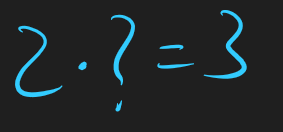
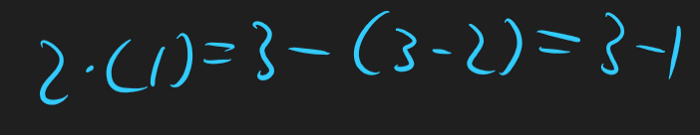
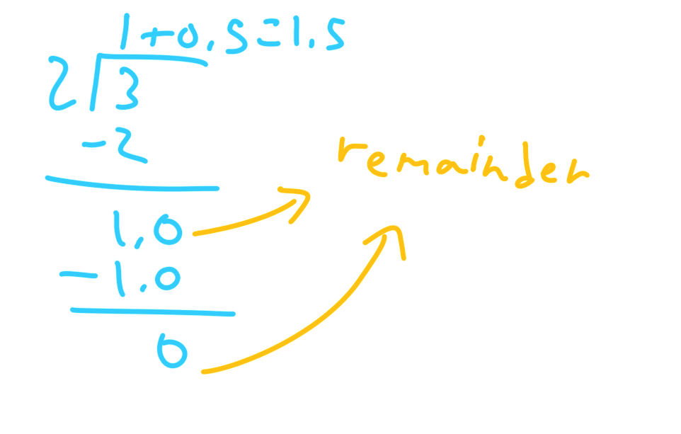
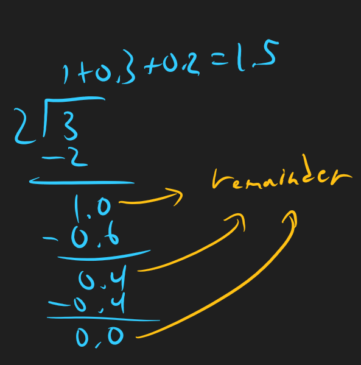
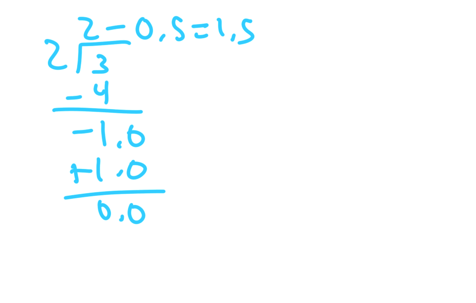

# Understanding Long Division (For Teachers)

Most people who have yet to grow accustomed to a calculator, likely know how to divide any two numbers to obtain the decimal quotient. However, rarely it seems that the algorithm is actually explained, which means that the procedure is most often memorized without a sense of intuition. The hope of this article will be to introduce the intuition, and to finally demystify the mysteries of division.

## Simple Algebraic Notation

Say we want to calculate 3/2. We can setup our equation as such:

That is two times an unknown number that should equal three. By solving what the unknown is, we solve what 3/2 is. We can now start approximating the value. Very clearly, our unknown cannot be less than one, since three is larger than two. As such:

The “-1” is the remainder. We accounted for the two in the three, but the one was left unaccounted for, hence why it is called the remainder. This isn’t a problem, it simply means our work is not done yet (assuming the quotient is rational and doesn’t repeat). We know that 2 * 5 = 10. By use of algebra, we can divide both sides by 10, and we have 2 * .5 = 1. So:

We have a “0” as our remainder now, which means our work is done. Notice, that with the first part of our equation, we’re effectively saying “one and a half of two,” and preforming the arithmetic, we have 1.5 as our answer.

With this notation, I hope you can see the under working of division. The goal of division is to describe the dividend, three, in terms of the divisor, two. Which means, our question is, how many twos do we need for it to be equivalent of two. Because we’re simply looking for the quantity of twos, we can start from 0, and keep incrementing (or decrementing) by an arbitrary but reasonable amount, until the expression equals three, or the remainder is 0.

In our case, we started with 0, then incremented by one unit of two. We still had a remainder of one, so we incremented by half a two to account for the one. As such, we now know that adding one two with half a two would equate to three.

## Long Division Notation

The work done above can be done more compactly using the long division notation you’re familiar with.

Since we are simply adding, we could’ve also received the same answer with different numbers.

For the fun of it, we can also introduce negatives:

If you want to further experiment with this idea of doing division, then you’re free to try out my program at:
[https://replit.com/@amrojjeh/LongDivision#main.py](https://replit.com/@amrojjeh/LongDivision#main.py)