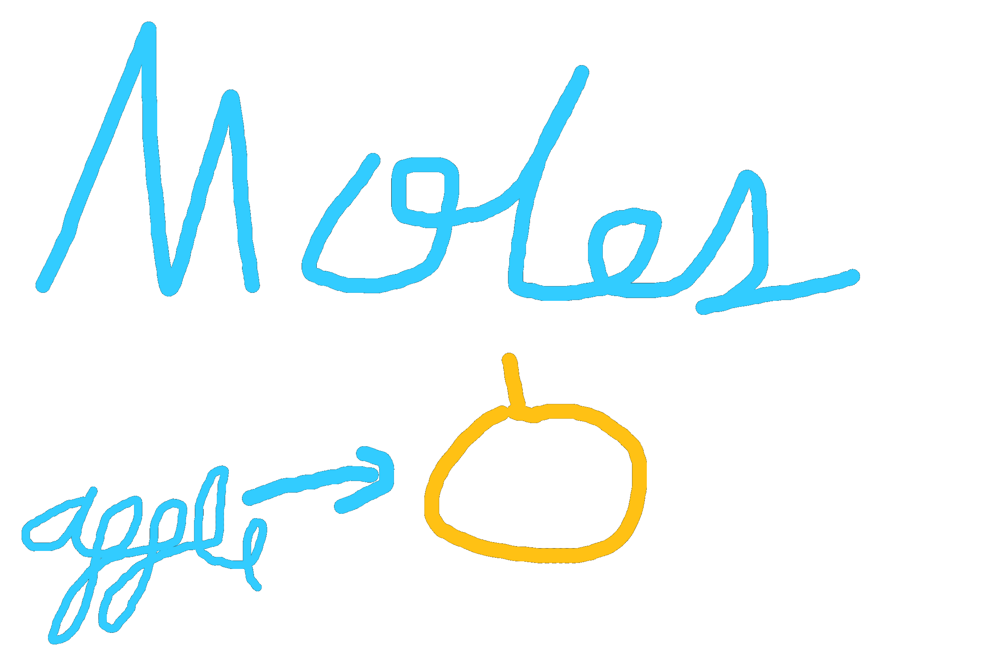

A mole is a quantity (like a dozen) that would be equivalent to the number of Carbon-12 atoms in a sample of 12 grams of carbon. To rephrase in a question, how many carbon-12 atoms are there in a sample of 12 grams of carbon? The answer, a mole of carbon-12 atoms.

So then what is a mole? A mole is 6.022x10²³. Not 6.022x10²³ atoms, just 6.022x10²³. Just like how a dozen is 12, not 12 apples or 12 pineapples, just 12. You can use the quantity to describe several objects, so you could say that you have two moles of cookies. However, moles are most often affiliated to atoms, hence its massive number.

Back to the original question, how many carbon-12 atoms are there in a sample of 12 grams of carbon? Since there is 1 mole of atoms, there are 6.022x10²³ atoms of carbon-12. Notice how 1 mole of Carbon-12 atoms (12 amu), equals 12 grams of carbon.

Could this be used to answer other questions about other elements? Absolutely. If you take a mole of Hydrogen-1, it will also be 1 gram of Hydrogen. This concept applies to all elements, if you take a mole of x amu, you will always end up with x grams. Why does this work, however?

Imagine that we have a filled basket. Each basket holds 12 grams of apples, and each type of apples can weigh differently. There are red apples, green apples, and yellow apples, each weighing one gram, two grams, and three grams respectively. Now, how many red apples(1g) are there in a single basket (12g)? A dozen. How many green apples(2g) are there in two baskets(24g)? Also, a dozen. How many yellow apples are there in a sample of three baskets? Yet again, a dozen.

Let’s compare this analogy to moles. A single basket would represent a single gram, and an apple’s mass would represent an atom’s mass in amus. The dozen would be analogous to Avogadro’s number, 6.022x10²³. In both cases, the apples’ mass (amus), was the same as the number of baskets (grams).

To wrap this up, here’s a table that demonstrates moles across different elements.

| Element  | Average Atomic Mass (amu) | Number of Moles (mol) | Total Mass of Moles (g) |
|----------|---------------------------|-----------------------|-------------------------|
| Hydrogen | 1.01                      | 1                     | 1.01                    |
| Lithium  | 6.941                     | 1                     | 6.941                   |
| Carbon   | 12.01                     | 0.5                   | 6.005                   |
